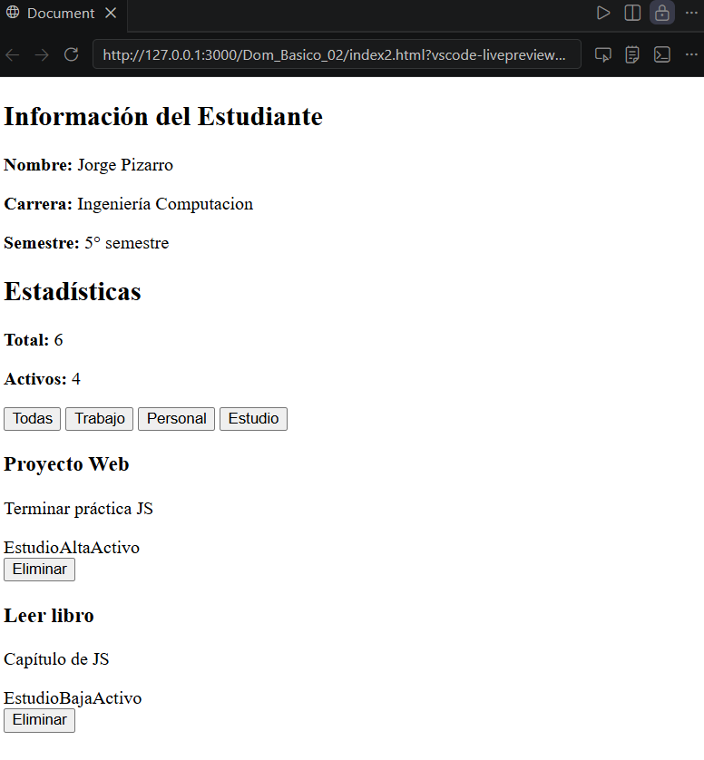
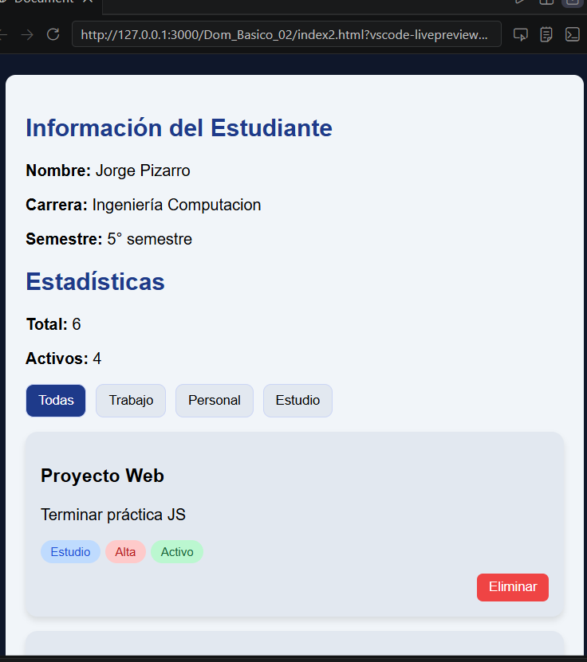

Esta aplicación web permite gestionar una lista de tareas de forma dinámica utilizando JavaScript.

El sistema implementa:

Visualización de información del estudiante
Renderizado dinámico de tarjetas
Filtrado por categorías (Trabajo, Personal, Estudio)
Eliminación de elementos
Visualización de estadísticas (total y activos)
Estilos personalizados con CSS

Se aplican conceptos de manipulación del DOM, eventos y estructuras de datos en JavaScript.

### 🔹 Renderizado de la lista

```js
function renderizarLista(datos) {
  const contenedor = document.getElementById('contenedor-lista');
  contenedor.innerHTML = '';

  datos.forEach(el => {
    const card = document.createElement('div');
    card.classList.add('card');

    const titulo = document.createElement('h3');
    titulo.textContent = el.titulo;

    card.appendChild(titulo);
    contenedor.appendChild(card);
  });
}

###  Vista general de la aplicación



### Filtrado aplicado

